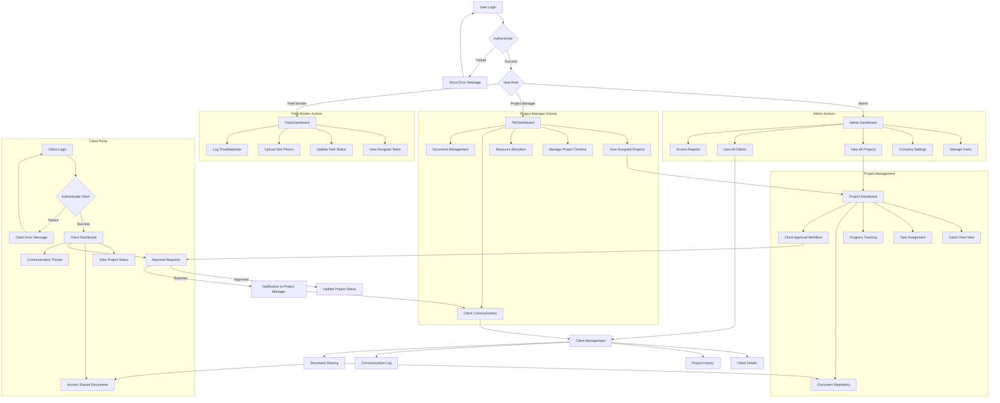

# Construction Management CRM

A multi-tenant SaaS CRM designed specifically for construction companies to manage clients, projects, and workflows with company-specific data isolation.

## Features

- Dashboard with key metrics (active projects, upcoming deadlines, client status)
- Project management module with Gantt charts and resource allocation
- Client portal with document sharing and approval workflows
- Multi-tenant architecture with complete data separation between companies
- Role-based permissions system for different team members (admin, project manager, field worker)

## System Architecture



## Tech Stack

- **Frontend**: React + TypeScript + Vite
- **UI Components**: ShadCN/UI + Tailwind CSS
- **Icons**: Lucide React
- **Routing**: React Router
- **State Management**: React Context
- **Authentication**: Custom Auth Context

## Getting Started

1. Clone the repository
2. Install dependencies: `npm install`
3. Start the development server: `npm run dev`
4. Open [http://localhost:5173](http://localhost:5173) to view it in the browser

## Development

This project uses Vite for fast development and hot module replacement (HMR).

### Available Scripts

- `npm run dev` - Start development server
- `npm run build` - Build for production
- `npm run preview` - Preview production build
- `npm run lint` - Run ESLint

## Project Structure

```
src/
├── components/
│   ├── auth/           # Authentication components
│   ├── clients/        # Client portal components
│   ├── dashboard/      # Dashboard components
│   ├── projects/       # Project management components
│   ├── integrations/   # Integration management
│   └── ui/            # Reusable UI components
├── contexts/          # React contexts
├── lib/              # Utility functions
└── types/            # TypeScript type definitions
```
